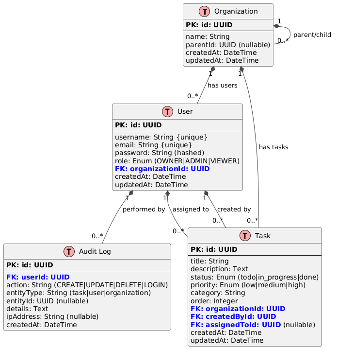
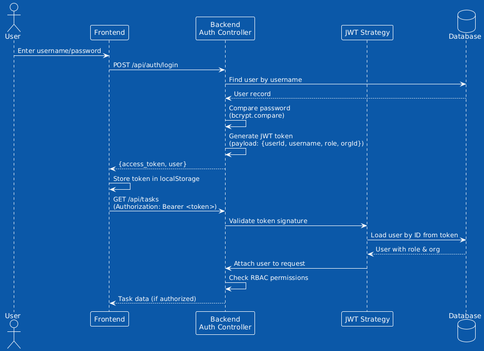

# SecureTasks - Enterprise Task Management with RBAC

A production-ready task management system built with **Angular 20**, **NestJS 10**, and **NX monorepo** architecture. Features comprehensive Role-Based Access Control (RBAC), JWT authentication, and a modern drag-and-drop Kanban interface.

## 🎯 Key Features

- **🔐 JWT Authentication** - Secure token-based authentication with bcrypt password hashing
- **👥 Role-Based Access Control (RBAC)** - Owner, Admin, and Viewer roles with hierarchical organization support
- **📊 Kanban Board** - Drag-and-drop task management with Angular CDK
- **🌓 Dark Mode** - Full dark/light theme toggle with localStorage persistence
- **⌨️ Keyboard Shortcuts** - Productivity shortcuts for common actions
- **📈 Analytics Dashboard** - Real-time task metrics and completion tracking
- **🔍 Audit Logging** - Comprehensive security audit trail for compliance (Owner/Admin only)
- **🧪 Comprehensive Testing** - 51 tests (38 backend Jest, 13 frontend Vitest)
- **🎨 Modern UI** - TailwindCSS with responsive design

---

## 📋 Table of Contents

1. [Quick Start](#-quick-start)
2. [Setup Instructions](#-setup-instructions)
3. [Architecture Overview](#-architecture-overview)
4. [Data Model](#-data-model)
5. [Access Control Implementation](#-access-control-implementation)
6. [API Documentation](#-api-documentation)
7. [Testing](#-testing)
8. [Keyboard Shortcuts](#-keyboard-shortcuts)
9. [Future Considerations](#-future-considerations)

---

## 🚀 Quick Start

```bash
# Install dependencies
npm install

# Start backend API (port 3000)
npx nx serve api

# Start frontend (port 4200) - in a new terminal
npx nx serve secure-tasks

# Run all tests
npx nx test api          # Backend tests (Jest)
npx nx test secure-tasks # Frontend tests (Vitest)
```

**Demo Accounts:**
- **Owner:** `owner` / `owner123`
- **Admin:** `admin` / `admin123`
- **Viewer:** `viewer` / `viewer123`

---

## 🛠️ Setup Instructions

### Prerequisites

- Node.js 18+ and npm
- Git

### 1. Clone and Install

```bash
git clone <repository-url>
cd secure-tasks
npm install
```

### 2. Environment Configuration

Create `.env` file in `apps/api/`:

```env
# JWT Configuration
JWT_SECRET=your-super-secret-jwt-key-change-in-production
JWT_EXPIRES_IN=24h

# Database Configuration
# SQLite is used by default - database file created automatically at:
# apps/api/database.sqlite

# Server Configuration
PORT=3000
NODE_ENV=development

# CORS Configuration (for frontend)
CORS_ORIGIN=http://localhost:4200
```

**🔒 Security Notes:**
- Replace `JWT_SECRET` with a cryptographically random string in production
- Use environment-specific secrets (never commit real secrets to git)
- Consider using a secrets manager (AWS Secrets Manager, HashiCorp Vault) for production

### 3. Database Setup

The SQLite database is **automatically initialized** on first run with:
- Schema creation (users, tasks, organizations, audit_logs)
- Seed data (3 demo accounts with sample tasks)

Database location: `apps/api/database.sqlite`

### 4. Start Development Servers

**Terminal 1 - Backend:**
```bash
npx nx serve api
# API runs on http://localhost:3000
```

**Terminal 2 - Frontend:**
```bash
npx nx serve secure-tasks
# App runs on http://localhost:4200
```

### 5. Run Tests

```bash
# Backend tests (31 tests)
npx nx test api

# Frontend tests (13 tests)
npx nx test secure-tasks

# Run both
npm run test:all
```

---

## 🏗️ Architecture Overview

### NX Monorepo Structure

```
secure-tasks/
├── apps/
│   ├── api/                      # NestJS Backend API
│   │   ├── src/
│   │   │   ├── app/
│   │   │   │   ├── auth/         # Authentication module (JWT, login)
│   │   │   │   ├── tasks/        # Task CRUD with RBAC enforcement
│   │   │   │   ├── audit/        # Audit logging service
│   │   │   │   ├── guards/       # RBAC authorization guards
│   │   │   │   └── entities/     # TypeORM entities
│   │   │   └── main.ts
│   │   ├── jest.config.cts       # Jest test configuration
│   │   └── database.sqlite       # SQLite database (auto-created)
│   │
│   └── secure-tasks/             # Angular Frontend
│       ├── src/
│       │   ├── app/
│       │   │   ├── dashboard.ts           # Main Kanban board
│       │   │   ├── login/                 # Login component
│       │   │   ├── services/              # HTTP services, auth, theme
│       │   │   └── task-chart.component.ts # Analytics visualization
│       │   └── main.ts
│       └── vitest.config.ts      # Vitest test configuration
│
├── libs/
│   ├── data/                     # Shared TypeScript interfaces/types
│   │   └── src/
│   │       └── lib/
│   │           └── data.ts       # UserRole, TaskStatus, TaskPriority enums
│   │
│   └── auth/                     # Shared auth utilities (future use)
│
├── nx.json                       # NX workspace configuration
├── package.json                  # Root dependencies
└── README.md                     # This file
```

### Monorepo Rationale

**Why NX Monorepo?**

1. **Code Sharing:** `libs/data` defines shared TypeScript types used by both frontend and backend, ensuring type safety across the stack
2. **Dependency Graph:** NX tracks dependencies between projects - changes to shared libs trigger affected project rebuilds
3. **Task Caching:** Build and test results are cached, speeding up CI/CD
4. **Consistent Tooling:** Unified commands (`npx nx <target> <project>`) for all apps
5. **Scalability:** Easy to add new apps (mobile, admin panel) or libraries (email service, notifications) without creating separate repos

**Shared Libraries:**

- **`@secure-tasks/data`:** Enums and interfaces (UserRole, TaskStatus, TaskPriority, etc.)
  - Frontend imports for type-safe HTTP requests
  - Backend imports for validation and business logic
  - Single source of truth prevents type mismatches

### Technology Stack

**Backend:**
- **NestJS 10** - Enterprise Node.js framework with decorators and dependency injection
- **TypeORM** - ORM for TypeScript with SQLite database
- **JWT (jsonwebtoken)** - Stateless authentication tokens
- **bcrypt** - Password hashing with salt rounds
- **class-validator** - DTO validation with decorators

**Frontend:**
- **Angular 20** - Latest Angular with standalone components
- **TailwindCSS v3** - Utility-first CSS framework
- **Angular CDK Drag-Drop** - Drag-and-drop functionality
- **RxJS** - Reactive programming for HTTP and state

**Testing:**
- **Jest** (Backend) - 31 tests covering auth, RBAC, services
- **Vitest** (Frontend) - 13 tests with Jest-compatible API

**Build Tools:**
- **NX 20** - Monorepo build system with caching
- **Vite** - Fast frontend development server
- **Webpack** - Backend bundling

---

## 📊 Data Model

### Entity Relationship Diagram



**Diagram shows:**
- **Organization** hierarchy (parent-child relationships)
- **User** roles and organization membership
- **Task** ownership, assignment, and status tracking
- **AuditLog** for security and compliance

### Schema Details

#### **Organization**
Hierarchical structure supporting parent-child relationships (e.g., "Acme Corp" → "Engineering Dept").

| Column | Type | Description |
|--------|------|-------------|
| id | UUID | Primary key |
| name | String | Organization name |
| parentId | UUID? | Parent organization (null for root) |
| createdAt | DateTime | Creation timestamp |
| updatedAt | DateTime | Last update timestamp |

#### **User**
User accounts with role-based permissions.

| Column | Type | Description |
|--------|------|-------------|
| id | UUID | Primary key |
| username | String | Unique username (used for login) |
| email | String | Unique email address |
| password | String | bcrypt hashed password (10 rounds) |
| role | Enum | UserRole: OWNER, ADMIN, or VIEWER |
| organizationId | UUID | Foreign key to Organization |
| createdAt | DateTime | Creation timestamp |
| updatedAt | DateTime | Last update timestamp |

**Role Hierarchy:**
- **OWNER:** Full access to own org + all child orgs
- **ADMIN:** Full access to own org + all child orgs
- **VIEWER:** Read-only access to own org + all child orgs

#### **Task**
Task items with status tracking and assignment.

| Column | Type | Description |
|--------|------|-------------|
| id | UUID | Primary key |
| title | String | Task title (required) |
| description | Text | Detailed task description |
| status | Enum | todo, in_progress, or done |
| priority | Enum | low, medium, or high |
| category | String | Task category (Development, Design, etc.) |
| order | Integer | Display order within status column |
| organizationId | UUID | Foreign key to Organization |
| createdById | UUID | Foreign key to User (creator) |
| assignedToId | UUID? | Foreign key to User (assignee, optional) |
| createdAt | DateTime | Creation timestamp |
| updatedAt | DateTime | Last update timestamp |

#### **AuditLog**
Immutable audit trail for compliance and security.

| Column | Type | Description |
|--------|------|-------------|
| id | UUID | Primary key |
| userId | UUID | Foreign key to User (actor) |
| action | String | CREATE, UPDATE, DELETE, LOGIN, LOGOUT |
| entityType | String | task, user, organization |
| entityId | UUID? | ID of affected entity |
| details | Text | Human-readable description |
| ipAddress | String? | Client IP address |
| createdAt | DateTime | Timestamp (immutable) |

**Audit Events Logged:**
- User login/logout
- Task creation, updates, deletion
- Permission denied attempts (for security monitoring)

---

## 🔐 Access Control Implementation

### Role-Based Access Control (RBAC)

#### Role Definitions

```typescript
export enum UserRole {
  OWNER = 'owner',    // Full control of organization
  ADMIN = 'admin',    // Full control of organization
  VIEWER = 'viewer'   // Read-only access
}
```

**Permission Matrix:**

| Action | Owner | Admin | Viewer |
|--------|-------|-------|--------|
| View all org tasks | ✅ | ✅ | ✅ |
| Create task | ✅ | ✅ | ❌ |
| Update task | ✅ | ✅ | ❌ |
| Delete task | ✅ | ✅ | ❌ |
| Change task status | ✅ | ✅ | ❌ |
| Change task priority | ✅ | ✅ | ❌ |
| Drag-drop tasks | ✅ | ✅ | ❌ |

### Organization Hierarchy

Organizations support **2-level hierarchy**:
- **Root Organization** (e.g., "Acme Corp")
  - **Child Organization 1** (e.g., "Engineering")
  - **Child Organization 2** (e.g., "Marketing")

**Access Rules:**
- Users can access tasks in **their organization + all descendant organizations**
- Example: Engineering dept user can see Engineering tasks but NOT Marketing tasks
- Root org users (Acme Corp) can see ALL tasks across all departments

**Implementation:**
```typescript
// TasksService.ts - getAccessibleOrganizationIds()
private async getAccessibleOrganizationIds(user: User): Promise<string[]> {
  const ids = [user.organizationId];
  
  // Find all child organizations
  const childOrgs = await this.organizationRepository.find({
    where: { parentId: user.organizationId }
  });
  
  ids.push(...childOrgs.map(org => org.id));
  return ids;
}
```

### JWT Authentication Flow



**Flow steps:**
1. User submits credentials to frontend
2. Backend validates password with bcrypt
3. JWT token generated with user payload (id, role, orgId)
4. Frontend stores token in localStorage
5. Subsequent requests include `Authorization: Bearer <token>` header
6. Backend validates token and enforces RBAC on each request

**Token Payload:**
```json
{
  "sub": "user-id-uuid",
  "username": "owner",
  "role": "owner",
  "organizationId": "org-id-uuid",
  "iat": 1704672000,
  "exp": 1704758400
}
```

### Backend RBAC Enforcement

#### 1. **JWT Guard** (All routes except login)
```typescript
@UseGuards(JwtAuthGuard)
@Controller('tasks')
export class TasksController { ... }
```

#### 2. **Roles Guard** (Specific endpoints)
```typescript
@Post()
@Roles(UserRole.OWNER, UserRole.ADMIN)
@UseGuards(JwtAuthGuard, RolesGuard)
async create(@Body() dto: CreateTaskDto, @Req() req) {
  return this.tasksService.create(dto, req.user);
}
```

**RolesGuard Logic:**
```typescript
@Injectable()
export class RolesGuard implements CanActivate {
  canActivate(context: ExecutionContext): boolean {
    const requiredRoles = this.reflector.get('roles', context.getHandler());
    const request = context.switchToHttp().getRequest();
    const user = request.user;
    
    return requiredRoles.includes(user.role);
  }
}
```

#### 3. **Service-Level Checks**
```typescript
// TasksService.ts
private async checkTaskAccess(task: Task, user: User, action: string) {
  // Verify task belongs to accessible organization
  const accessibleOrgIds = await this.getAccessibleOrganizationIds(user);
  
  if (!accessibleOrgIds.includes(task.organizationId)) {
    throw new ForbiddenException('Access denied');
  }
  
  // Viewers can only read
  if (user.role === UserRole.VIEWER && action !== 'read') {
    throw new ForbiddenException('Viewers have read-only access');
  }
}
```

### Frontend RBAC Implementation

**AuthService Methods:**
```typescript
export class AuthService {
  currentUser = signal<User | null>(null);
  
  hasRole(role: UserRole): boolean {
    return this.currentUser()?.role === role;
  }
  
  canEdit(): boolean {
    const role = this.currentUser()?.role;
    return role === UserRole.OWNER || role === UserRole.ADMIN;
  }
}
```

**Template Usage:**
```html
<!-- Show create form only for Owner/Admin -->
@if (canCreateTasks()) {
  <div class="bg-white rounded-lg p-6">
    <input [(ngModel)]="newTaskTitle" placeholder="Task title" />
    <button (click)="addTask()">Add Task</button>
  </div>
} @else {
  <div class="bg-yellow-50 p-4">
    <p><strong>View-Only Mode:</strong> Contact Admin to create tasks.</p>
  </div>
}

<!-- Disable drag-drop for viewers -->
<div cdkDrag [cdkDragDisabled]="!canEditTasks()">
  <!-- Task card -->
</div>
```

### Security Best Practices Implemented

✅ **Password Security:**
- bcrypt hashing with 10 salt rounds
- Passwords never logged or returned in responses

✅ **JWT Security:**
- Signed tokens with HS256 algorithm
- 24-hour expiration (configurable)
- Token stored in localStorage (XSS consideration noted in Future Considerations)

✅ **Input Validation:**
- class-validator DTOs on all endpoints
- SQL injection protection via TypeORM parameterized queries

✅ **Audit Logging:**
- All mutations logged with user ID, action, and timestamp
- IP address captured for security monitoring

✅ **Error Handling:**
- Generic error messages to prevent information leakage
- Detailed errors only in development mode

---

## 📡 API Documentation

**Base URL:** `http://localhost:3000/api`

### Authentication Endpoints

#### **POST** `/auth/login`
Authenticate user and receive JWT token.

**Request:**
```json
{
  "username": "owner",
  "password": "owner123"
}
```

**Response (200 OK):**
```json
{
  "access_token": "eyJhbGciOiJIUzI1NiIsInR5cCI6IkpXVCJ9...",
  "user": {
    "id": "550e8400-e29b-41d4-a716-446655440000",
    "username": "owner",
    "email": "owner@example.com",
    "role": "owner",
    "organizationId": "650e8400-e29b-41d4-a716-446655440000"
  }
}
```

**Errors:**
- `401 Unauthorized` - Invalid credentials

---

### Task Endpoints

**All task endpoints require `Authorization: Bearer <token>` header.**

#### **GET** `/tasks`
Retrieve all tasks accessible to the authenticated user.

**Headers:**
```
Authorization: Bearer <jwt_token>
```

**Response (200 OK):**
```json
[
  {
    "id": "750e8400-e29b-41d4-a716-446655440000",
    "title": "Implement user authentication",
    "description": "Add JWT-based authentication to the API",
    "status": "in_progress",
    "priority": "high",
    "category": "Development",
    "order": 1,
    "organizationId": "650e8400-e29b-41d4-a716-446655440000",
    "createdById": "550e8400-e29b-41d4-a716-446655440000",
    "assignedToId": null,
    "createdAt": "2026-01-08T10:00:00.000Z",
    "updatedAt": "2026-01-08T10:30:00.000Z",
    "createdBy": {
      "id": "550e8400-e29b-41d4-a716-446655440000",
      "username": "owner",
      "email": "owner@example.com"
    },
    "assignedTo": null,
    "organization": {
      "id": "650e8400-e29b-41d4-a716-446655440000",
      "name": "Acme Corp"
    }
  }
]
```

**Access Control:**
- Returns tasks from user's organization + child organizations
- Viewers, Admins, and Owners all see the same tasks (RBAC enforced on mutations)

---

#### **POST** `/tasks`
Create a new task.

**Requires Role:** `OWNER` or `ADMIN`

**Request:**
```json
{
  "title": "Fix login bug",
  "description": "Users cannot log in with special characters in password",
  "status": "todo",
  "priority": "high",
  "category": "Bug"
}
```

**Response (201 Created):**
```json
{
  "id": "850e8400-e29b-41d4-a716-446655440000",
  "title": "Fix login bug",
  "description": "Users cannot log in with special characters in password",
  "status": "todo",
  "priority": "high",
  "category": "Bug",
  "order": 0,
  "organizationId": "650e8400-e29b-41d4-a716-446655440000",
  "createdById": "550e8400-e29b-41d4-a716-446655440000",
  "createdAt": "2026-01-08T14:00:00.000Z",
  "updatedAt": "2026-01-08T14:00:00.000Z"
}
```

**Errors:**
- `400 Bad Request` - Validation failed (missing required fields)
- `403 Forbidden` - User role is VIEWER
- `401 Unauthorized` - Invalid/missing JWT token

---

#### **PATCH** `/tasks/:id`
Update an existing task.

**Requires Role:** `OWNER` or `ADMIN`

**Request:**
```json
{
  "status": "done",
  "priority": "medium"
}
```

**Response (200 OK):**
```json
{
  "id": "750e8400-e29b-41d4-a716-446655440000",
  "title": "Implement user authentication",
  "status": "done",
  "priority": "medium",
  "updatedAt": "2026-01-08T15:00:00.000Z"
}
```

**Errors:**
- `403 Forbidden` - User role is VIEWER or task not in accessible org
- `404 Not Found` - Task ID does not exist

---

#### **DELETE** `/tasks/:id`
Delete a task.

**Requires Role:** `OWNER` or `ADMIN`

**Response (200 OK):**
```json
{
  "message": "Task deleted successfully"
}
```

**Errors:**
- `403 Forbidden` - User role is VIEWER or task not in accessible org
- `404 Not Found` - Task ID does not exist

---

### Audit Log Endpoints

#### **GET** `/audit-log`
Retrieve audit logs for security monitoring and compliance.

**Requires Role:** `OWNER` or `ADMIN`

**Query Parameters:**
- `resource` (optional) - Filter by resource type (e.g., "task", "user")
- `userId` (optional) - Filter by user ID

**Headers:**
```
Authorization: Bearer <jwt_token>
```

**Response (200 OK):**
```json
[
  {
    "id": "950e8400-e29b-41d4-a716-446655440000",
    "userId": "550e8400-e29b-41d4-a716-446655440000",
    "action": "CREATE",
    "resource": "task",
    "resourceId": "750e8400-e29b-41d4-a716-446655440000",
    "details": "Created task: Implement user authentication",
    "ipAddress": "127.0.0.1",
    "timestamp": "2026-01-08T10:00:00.000Z",
    "user": {
      "id": "550e8400-e29b-41d4-a716-446655440000",
      "username": "owner",
      "email": "owner@example.com"
    }
  },
  {
    "id": "960e8400-e29b-41d4-a716-446655440000",
    "userId": "550e8400-e29b-41d4-a716-446655440000",
    "action": "LOGIN",
    "resource": "auth",
    "resourceId": null,
    "details": "User logged in successfully",
    "ipAddress": "127.0.0.1",
    "timestamp": "2026-01-08T09:30:00.000Z",
    "user": {
      "id": "550e8400-e29b-41d4-a716-446655440000",
      "username": "owner",
      "email": "owner@example.com"
    }
  }
]
```

**Logged Actions:**
- `LOGIN` - User authentication
- `CREATE` - Resource creation (tasks, users)
- `UPDATE` - Resource modification
- `DELETE` - Resource deletion
- `ACCESS_DENIED` - Failed permission checks

**Use Cases:**
- Security monitoring and threat detection
- Compliance auditing (GDPR, SOC2, HIPAA)
- Debugging permission issues
- User activity tracking

**Errors:**
- `403 Forbidden` - User role is VIEWER (not authorized)
- `401 Unauthorized` - Invalid/missing JWT token

---

### Response Status Codes

| Code | Meaning | Usage |
|------|---------|-------|
| 200 | OK | Successful GET, PATCH, DELETE |
| 201 | Created | Successful POST (resource created) |
| 400 | Bad Request | Validation errors, malformed JSON |
| 401 | Unauthorized | Missing/invalid JWT token |
| 403 | Forbidden | Valid token but insufficient permissions |
| 404 | Not Found | Resource ID does not exist |
| 500 | Internal Server Error | Unexpected server error |

---

## 🧪 Testing

### Test Coverage

**Backend (Jest):**
- ✅ 38 tests passing
- Coverage: Auth, RBAC, Task CRUD, Audit Logs, Services, Guards

**Frontend (Vitest):**
- ✅ 13 tests passing  
- Coverage: AuthService, TaskService, Components

**Total:** 51/51 tests passing

### Running Tests

```bash
# Backend tests
npx nx test api

# Frontend tests
npx nx test secure-tasks

# Watch mode (auto-rerun on changes)
npx nx test api --watch
npx nx test secure-tasks --watch

# Coverage report
npx nx test api --coverage
npx nx test secure-tasks --coverage
```

### Test Examples

**Backend RBAC Test:**
```typescript
it('should prevent viewer from creating tasks', async () => {
  const dto: CreateTaskDto = { title: 'Test', status: 'todo' };
  
  await expect(
    service.create(dto, mockViewer, '127.0.0.1')
  ).rejects.toThrow(ForbiddenException);
});
```

**Frontend Auth Test:**
```typescript
it('should store user after successful login', async () => {
  authService.login('owner', 'owner123').subscribe();
  
  expect(authService.currentUser()).toBeTruthy();
  expect(authService.currentUser()?.username).toBe('owner');
});
```

---

## ⌨️ Keyboard Shortcuts

| Key | Action |
|-----|--------|
| `?` | Show keyboard shortcuts help modal |
| `/` | Focus search field |
| `n` | Focus new task input (if allowed) |
| `r` | Refresh task list |
| `t` | Toggle dark/light theme |
| `c` | Clear all filters |
| `Esc` | Close modals |

*Shortcuts disabled when typing in input fields.*

---

## 🚀 Future Considerations

### Advanced RBAC Features

**1. Advanced Role Delegation**
- **Custom Roles:** Define custom roles beyond Owner/Admin/Viewer (e.g., "Project Manager", "Developer")
- **Granular Permissions:** Per-task permissions (e.g., "Can edit tasks in 'Development' category only")
- **Temporary Access:** Time-limited role assignments (e.g., "Admin access for 7 days")
- **Role Inheritance:** Base roles with additive permissions

**Implementation Strategy:**
```typescript
// New entities
@Entity()
class Permission {
  id: string;
  resource: string; // 'task', 'user', 'organization'
  action: string;   // 'create', 'read', 'update', 'delete'
  scope: string;    // 'own', 'org', 'all'
}

@Entity()
class Role {
  id: string;
  name: string;
  permissions: Permission[];
}

// Check permission instead of role
if (user.hasPermission('task', 'update', task.organizationId)) {
  // Allow update
}
```

### Production-Ready Security

**2. JWT Refresh Tokens**
- **Problem:** Access tokens expire, forcing re-login
- **Solution:** Short-lived access tokens (15 min) + long-lived refresh tokens (7 days)
- **Flow:**
  1. Login returns both `access_token` and `refresh_token`
  2. Frontend stores refresh token in httpOnly cookie
  3. When access token expires, request new one with refresh token
  4. Refresh tokens stored in database for revocation

```typescript
// New endpoint
@Post('refresh')
async refresh(@Req() req) {
  const refreshToken = req.cookies['refresh_token'];
  const newAccessToken = await this.authService.refreshAccessToken(refreshToken);
  return { access_token: newAccessToken };
}
```

**3. CSRF Protection**
- **Problem:** Malicious sites can make authenticated requests if tokens in cookies
- **Solution:** CSRF tokens for state-changing operations
- **Implementation:** Use NestJS `csurf` middleware, include CSRF token in forms

**4. Rate Limiting**
- **Problem:** Brute force attacks on login endpoint
- **Solution:** `@nestjs/throttler` to limit requests per IP
```typescript
@Throttle(5, 60) // 5 requests per 60 seconds
@Post('login')
async login(@Body() dto: LoginDto) { ... }
```

**5. HTTPS Enforcement**
- **Problem:** JWT tokens transmitted over HTTP are vulnerable
- **Solution:** Force HTTPS in production, use secure cookies

**6. Token Storage Security**
- **Current:** localStorage (vulnerable to XSS)
- **Better:** httpOnly cookies (not accessible to JavaScript)
- **Best:** httpOnly cookies + CSRF protection

### Performance & Scalability

**7. RBAC Caching**
- **Problem:** Permission checks query database on every request
- **Solution:** Cache user permissions in Redis with TTL
```typescript
// Pseudo-code
async getUserPermissions(userId: string): Promise<Permission[]> {
  const cached = await redis.get(`permissions:${userId}`);
  if (cached) return JSON.parse(cached);
  
  const permissions = await db.loadPermissions(userId);
  await redis.setex(`permissions:${userId}`, 300, JSON.stringify(permissions));
  return permissions;
}
```

**8. Database Indexing**
- Add indexes on frequently queried fields:
  - `tasks.organizationId` (for filtering by org)
  - `tasks.status` (for Kanban columns)
  - `tasks.order` (for sorting)
  - `users.username`, `users.email` (for login)

**9. Pagination**
- **Problem:** Loading 10,000+ tasks crashes browser
- **Solution:** Cursor-based pagination
```typescript
@Get()
async findAll(
  @Query('cursor') cursor?: string,
  @Query('limit') limit = 50
) {
  return this.tasksService.findAllPaginated(cursor, limit);
}
```

**10. WebSocket Real-Time Updates**
- **Problem:** Users don't see tasks created by others until refresh
- **Solution:** Socket.io for real-time task updates
```typescript
@WebSocketGateway()
export class TasksGateway {
  @SubscribeMessage('taskCreated')
  handleTaskCreated(client: Socket, task: Task) {
    // Broadcast to all users in same organization
    this.server.to(`org:${task.organizationId}`).emit('taskCreated', task);
  }
}
```

### Monitoring & Observability

**11. Structured Logging**
- Replace console.log with Winston/Pino
- Include request IDs for tracing
- Log to external service (e.g., Datadog, CloudWatch)

**12. Metrics & Alerting**
- Track API latency, error rates
- Alert on failed login attempts (potential attack)
- Monitor database connection pool

**13. APM (Application Performance Monitoring)**
- Use New Relic or Datadog APM
- Track slow database queries
- Identify performance bottlenecks

### Additional Features

**14. Task Attachments**
- Upload files (images, documents) to tasks
- Store in S3/GCS with presigned URLs

**15. Task Comments**
- Threaded discussions on tasks
- @mentions with notifications

**16. Email Notifications**
- Task assignments, due date reminders
- Daily digest of completed tasks

**17. Activity Feed**
- Real-time feed of organization activity
- Filter by user, action type, date range

**18. Export/Import**
- Export tasks to CSV/JSON
- Import from Jira, Trello, etc.

---

## 📄 License

MIT License - See LICENSE file for details

---

## 👥 Contributing

1. Fork the repository
2. Create a feature branch (`git checkout -b feature/amazing-feature`)
3. Commit changes (`git commit -m 'Add amazing feature'`)
4. Push to branch (`git push origin feature/amazing-feature`)
5. Open a Pull Request

---

## 📞 Support

For questions or issues:
- Open a GitHub issue
- Contact: [your-email@example.com]

---

**Built with ❤️ using Angular, NestJS, and NX**

```sh
npx nx g @nx/angular:lib mylib
```

You can use `npx nx list` to get a list of installed plugins. Then, run `npx nx list <plugin-name>` to learn about more specific capabilities of a particular plugin. Alternatively, [install Nx Console](https://nx.dev/getting-started/editor-setup?utm_source=nx_project&utm_medium=readme&utm_campaign=nx_projects) to browse plugins and generators in your IDE.

[Learn more about Nx plugins &raquo;](https://nx.dev/concepts/nx-plugins?utm_source=nx_project&utm_medium=readme&utm_campaign=nx_projects) | [Browse the plugin registry &raquo;](https://nx.dev/plugin-registry?utm_source=nx_project&utm_medium=readme&utm_campaign=nx_projects)


[Learn more about Nx on CI](https://nx.dev/ci/intro/ci-with-nx#ready-get-started-with-your-provider?utm_source=nx_project&utm_medium=readme&utm_campaign=nx_projects)

## Install Nx Console

Nx Console is an editor extension that enriches your developer experience. It lets you run tasks, generate code, and improves code autocompletion in your IDE. It is available for VSCode and IntelliJ.

[Install Nx Console &raquo;](https://nx.dev/getting-started/editor-setup?utm_source=nx_project&utm_medium=readme&utm_campaign=nx_projects)

## Useful links

Learn more:

- [Learn more about this workspace setup](https://nx.dev/getting-started/tutorials/angular-monorepo-tutorial?utm_source=nx_project&amp;utm_medium=readme&amp;utm_campaign=nx_projects)
- [Learn about Nx on CI](https://nx.dev/ci/intro/ci-with-nx?utm_source=nx_project&utm_medium=readme&utm_campaign=nx_projects)
- [Releasing Packages with Nx release](https://nx.dev/features/manage-releases?utm_source=nx_project&utm_medium=readme&utm_campaign=nx_projects)
- [What are Nx plugins?](https://nx.dev/concepts/nx-plugins?utm_source=nx_project&utm_medium=readme&utm_campaign=nx_projects)

And join the Nx community:
- [Discord](https://go.nx.dev/community)
- [Follow us on X](https://twitter.com/nxdevtools) or [LinkedIn](https://www.linkedin.com/company/nrwl)
- [Our Youtube channel](https://www.youtube.com/@nxdevtools)
- [Our blog](https://nx.dev/blog?utm_source=nx_project&utm_medium=readme&utm_campaign=nx_projects)
