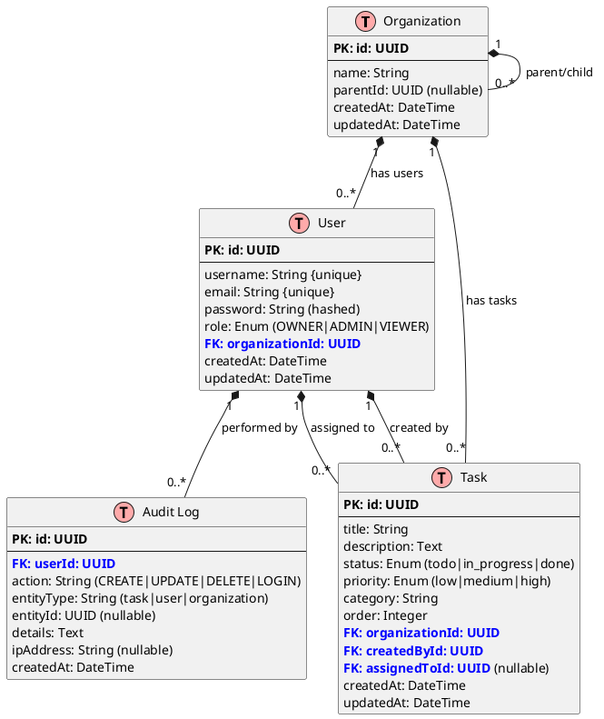
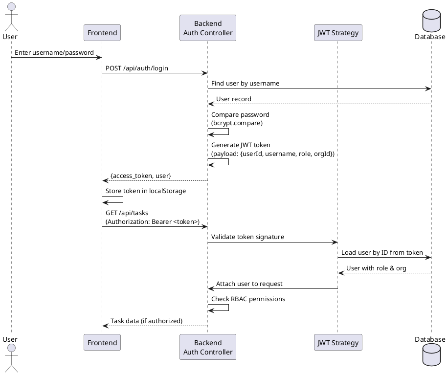

# Diagram Images

This folder contains diagram screenshots referenced in the main README.

## Required Diagrams

### 1. `erd-diagram.png`
**Entity Relationship Diagram** showing:
- Organization (with parent-child hierarchy)
- User (with roles and organization links)
- Task (with status, priority, assignments)
- AuditLog (for security tracking)

**How to generate:**
1. Copy the PlantUML code below
2. Paste into [plantuml.com](http://www.plantuml.com/plantuml/uml/)
3. Export as PNG and save as `erd-diagram.png`



---

### 2. `jwt-flow.png`
**JWT Authentication Flow** sequence diagram showing:
- User login with credentials
- Password verification with bcrypt
- JWT token generation and storage
- Authenticated API requests with Bearer token
- RBAC permission checks

**How to generate:**
1. Copy the PlantUML code below
2. Paste into [plantuml.com](http://www.plantuml.com/plantuml/uml/)
3. Export as PNG and save as `jwt-flow.png`



---

## Alternative: VS Code PlantUML Extension

Instead of using the online tool, you can install the **PlantUML extension** in VS Code:

1. Install extension: `jebbs.plantuml`
2. Install Java (required for PlantUML)
3. Open the PlantUML code in a `.puml` file
4. Press `Alt+D` to preview
5. Right-click preview → Export as PNG

---

## Optional: Additional Screenshots

You can also add screenshots of the application itself:
- `dashboard-light.png` - Light mode Kanban board
- `dashboard-dark.png` - Dark mode Kanban board
- `analytics-chart.png` - Task completion metrics
- `keyboard-shortcuts.png` - Shortcuts help modal

Simply take screenshots and reference them in the README with:
```markdown

```
